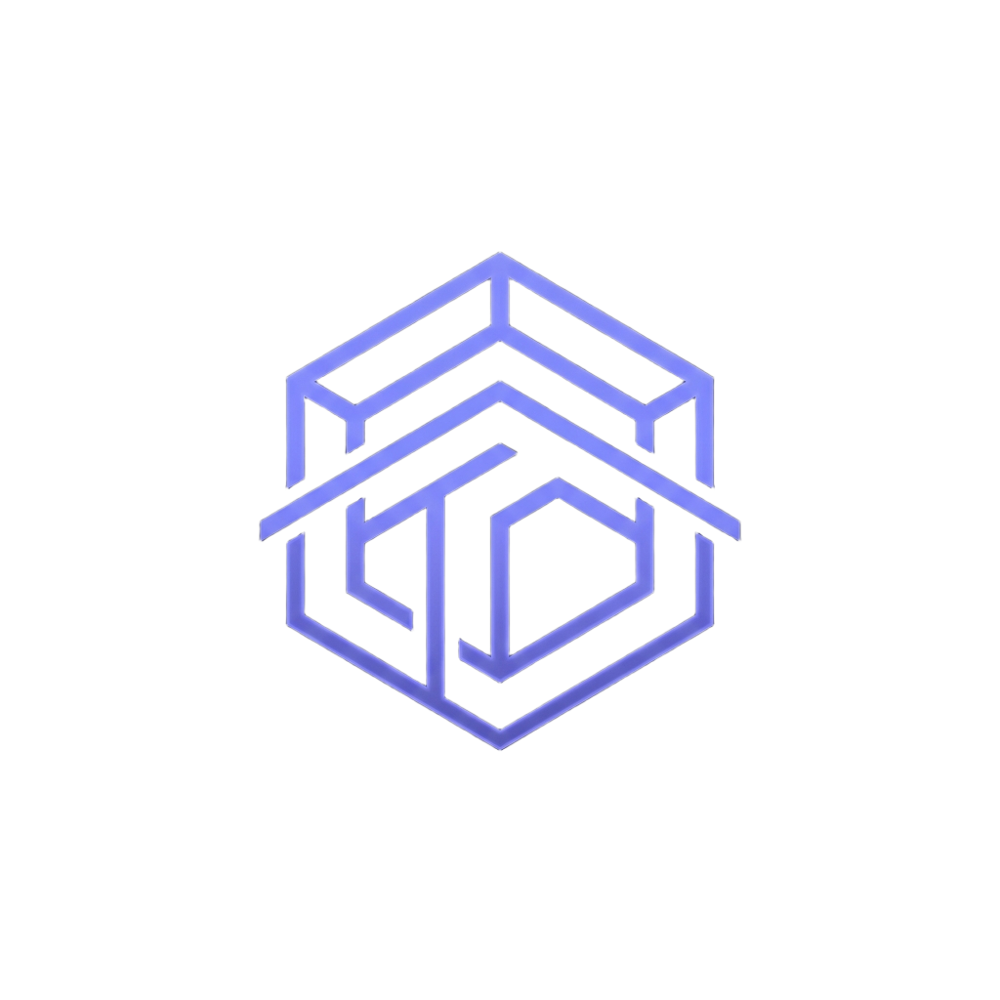

<p align="center">
  
</p>

<h1 align="center">TectumOS</h1>

<p align="center">
  <strong>O Sistema Operacional e Painel Definitivo para seu Homelab.</strong><br>
  Leve, rápido, com design <i>Liquid Glass</i> e gerenciamento de ponta a ponta.
</p>

<p align="center">
  
  
  
</p>

<hr>

## 🚀 Instalação Rápida (One-Liner)

Se este repositório for **Público**, você pode instalar o TectumOS em qualquer máquina rodando Ubuntu/Debian com apenas um comando no terminal:

```bash
curl -fsSL https://raw.githubusercontent.com/Tascok/TectumOS/master/install.sh | sudo bash
```

> **Aviso:** Como este repositório é **Privado** atualmente, o comando acima retornará erro 404. Para testar a instalação agora, faça o clone manual do repositório ou torne-o público nas configurações do GitHub.

## 📦 O que o instalador faz?
1. Instala as dependências (Go, Node.js, Make).
2. Clona este repositório para `/opt/tectumos`.
3. Compila o Frontend (Vite) e o Backend (Go).
4. Cria o serviço no **systemd** para rodar automaticamente junto com o sistema.

## 🛠️ Tecnologias
- **Frontend**: Vanilla JS (Sem frameworks pesados), CSS Moderno, Vite.
- **Backend**: Go (Golang), Fiber.
- **Integração com SO**: systemd, lsblk, bash nativo.

## 🎨 Filosofia de Design
Inspirado na estética *Umbrel OS*, o TectumOS foca em uma interface minimalista profunda, utilizando fundos escuros e acabamento em vidro translúcido com altas taxas de desfoque, removendo distrações e mantendo o foco no seu hardware e nos seus aplicativos.
